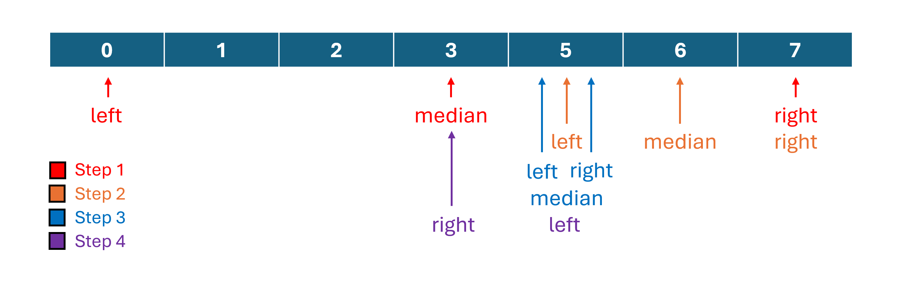

# 35. Search Insert Position

> **Difficulty:** Easy  

> **Tags:** Binary Search

> **LeetCode Link:** [35. Search Insert Position](https://leetcode.com/problems/search-insert-position)

> **Solution:** [`solution.py`](./solution.py)

---

## Intuition

Use binary search on the sorted array to locate the target. If the target exists, return its index. Otherwise, return the position where it should be inserted.

## Approach
1. **Binary search**
    (Example: target = 4)
    - 
    - Use the condition `while left <= right` rather than `left < right`.
    Otherwise, if `nums` contain only one element (e.g. [1]), that element will be missed
    - Compute `median = (left + right) // 2`.
    - If `nums[median] < target`, move `left` to `median + 1` rather than `median`. It is because `nums[median]` is already confirmed to be smaller than the target so it can never be the insertion point.
    - If `nums[median] > target`, move `right` to `median - 1`. Similarly, `nums[median]` is already confirmed to be larger than the target so it can never be the insertion point.
    - If `nums[median] == target`, return `median`.

2. **Return insertion position**
    - When the loop terminates without finding the target, `left` marks the first index whose value is greater than the target while `right` marks the last index whose value is smaller than the target. Therefore, `left` is the position where the target should be inserted. 

## Complexity 
|   | Complexity | Explanation |
|--------|-----------|-------------|
| **Time** | O(log n) | The search space is halved in each iteration. |
| **Space** | O(1) | Only a constant number of pointers are used. |