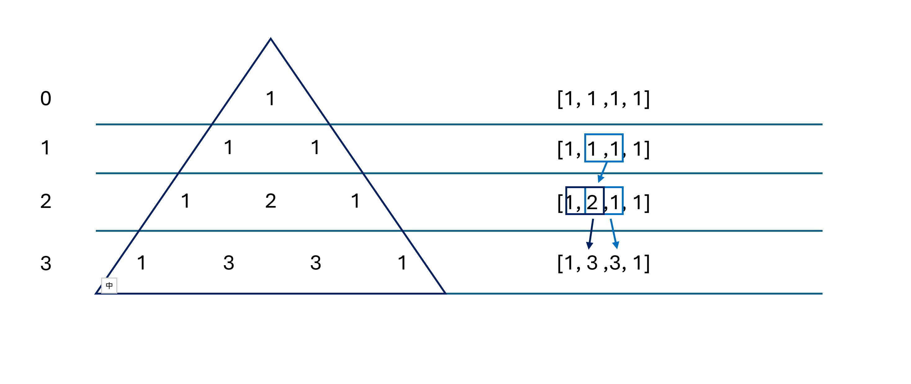

# 119. Pascal's Triangle II

> **Difficulty:** Easy  

> **Tags:** Dynamic Programming

> **LeetCode Link:** [119. Pascal's Triangle II](https://leetcode.com/problems/pascals-triangle-ii)

> **Solution:** [`solution.py`](./solution.py)

---

## Intuition

Construct an array of all 1s to represent the target row. For each level, update the values ​​within the array from right to left, adding each value to its left neighbor. 

## Approach

## Complexity 
|   | Complexity | Explanation |
|--------|-----------|-------------|
| **Time** | O(n ^ 2) | The outer loop runs up to `rowIndex` times, and the inner loop runs up to `rowIndex` times. |
| **Space** | O(n) | Only a single array of length `rowIndex + 1` is used. |