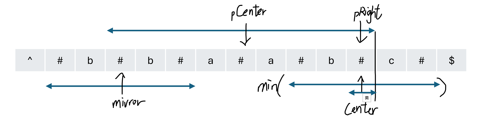
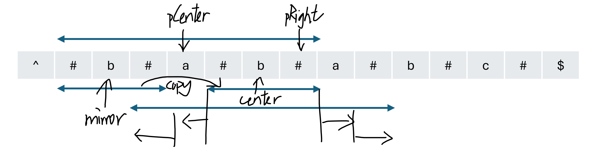
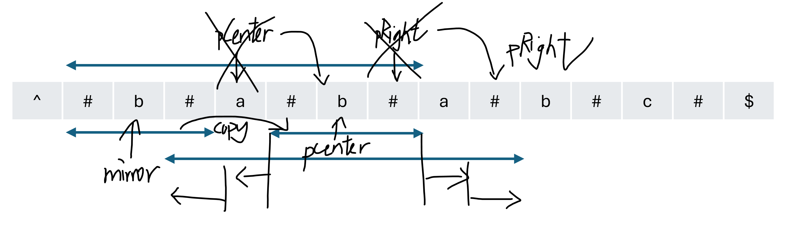

# 5. Longest Palindromic Substring

> **Difficulty:** Medium  

> **Tags:** String

> **LeetCode Link:** 

> **Solution:** [`solution_manacher.py`](./solution_manacher.py)

---

## Intuition

Transform the string by inserting `#` so that every palindrome (odd or even) has a single center. Then, scan from left to right while maintaining the rightmost palindrome boundary unchanged. For each `center`, if it lies inside the boundary, copy the symmetric counterpart's radius to avoid redundant comparisons. Otherwise, find the palindrom by expanding from center. If a newly expanded palindrome exceeds the boundary, update center and the right edge to this new rightmost palindrome.

## Approach
1. **Preprocessing:**
    - Insert `#` between every two characters and wrap the string with distinct boundary characters (`^` and `$`). This ensure that every center is a single index.

2. **Initialize:**
    - `radius[i]` stores the expansion arm length of the palindrome centered at `i`.
    - `pCenter` and `pRight` record the index of the center and the right edge of the rightmost palindrome found so far.

3. **Initialize radius from mirror**
   - For each `center`, if it lies inside `pRight`, its symmetric point `mirror = 2 * pCenter - center` has already been solved.
   - Set `radius[center]` to the smaller of:
        - `radius[mirror]` (the full arm length of the symmetric point), or
        - `pRight - center` (the distance to the known boundary, since characters beyond `pRight` have never been compared and cannot be assumed to match).

    

4. **Expand beyond the boundary**
   - Starting from the initialized radius, continue expanding outward.

       

5. **Update boundary**
   - If the newly expanded palindrome exceeds `pRight`, update `pCenter` and `pRight` to this new rightmost palindrome.

    

6. **Extract result**
   - Locate the maximum radius and its center. Convert back to original string coordinates with `start = (maxCenter - maxLen) // 2`, then return the corresponding substring.

## Complexity 

|   | Complexity | Explanation |
|--------|-----------|-------------|
| **Time** | O(n) | The right boundary `pRight` only moves in one direction. Every successful character comparison will move `pRight`forward, so each character is compared at most twice across the entire run. |
| **Space** | O(n) | The transformed string and the `radius` array each require O(n) auxiliary space. |     

---

**Alternative - Expand Around Center**

> **Tags:** String, Two Pointers 

> **LeetCode Link:** [5. Longest Palindromic Substring](https://leetcode.com/problems/longest-palindromic-substring/solutions/8485908/longest-palindromic-substring-expand-fro-1ziy)

> **Solution:** [`solution_expand_around_center.py`](./solution_expand_around_center.py)

---

## Intuition

Treat every character (and every pair of adjacent characters) as the center of a potential palindrome, then expand outward from the center in both directions. Record the longest valid palindrome found.

## Approach

1. **Expand around center**
    - For each character in `s`, treat it as a `center` to expand outward continuously when the characters of `left` and `right` are equal.

2. **Check both odd and even length cases**
    - For each index `center` in the `s`:
    - **Odd length:** `expandFromCenter(center, center)`, the center is a single character.
    - **Even length:** `expandFromCenter(center, center + 1)`, the center lies between two characters.

3. **Update the maximum**
    - After each expansion, compare the current palindrome length with `maxLen`.
    - If a longer palindrome is found, update `maxLen` and `maxStart`.

4. **Return**
    - Extract and return the substring from `maxStart` with length `maxLen`.

## Complexity 
   
|   | Complexity | Explanation |
|--------|-----------|-------------|
| **Time** | O(n ^ 2) | There are `n` centers; each expansion may scan up to `n` characters in the worst case. |
| **Space** | O(1) | Only a constant number of variables are used. |        
