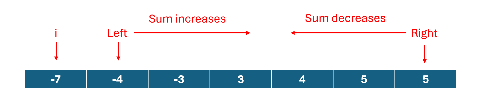
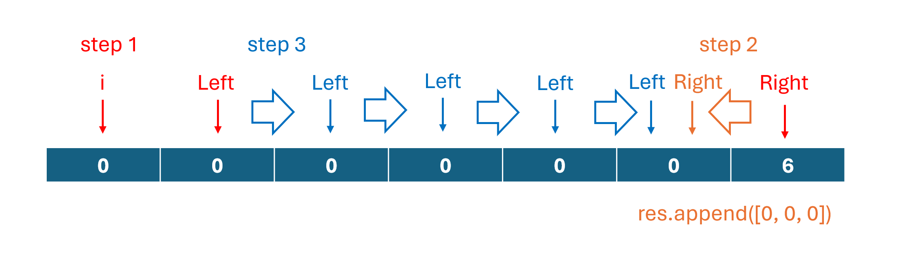

# 15. 3Sum

> **Difficulty:** Medium  

> **Tags:** Two Pointers

> **LeetCode Link:** [15. 3Sum](https://leetcode.com/problems/3sum)

> **Solution:** [`solution.py`](./solution.py)

---

## Intuition

Sort the array to bring duplicates together, then fix one number and reduce the problem to a **2Sum** problem. Use two pointers on the remaining range to find pairs that complete the sum to zero. Skip the duplicate values to avoid repeated triplets.

## Approach
1. **Sort**
   - Sort `nums` to enable duplicate skipping two-pointer scan.

2. **Fix the first number**
   - Iterate `i` over `range(len(nums) - 2)`. This is because a triplet require at least three number to form.
   - If `nums[i] > 0`, break immediately. Given that the array is sorted, all remaining numbers are non-negative and cannot sum to zero.
   - If `i > 0` and `nums[i] == nums[i-1]`, skip to avoid duplicate triplets.

3. **Two-pointer scan**
   - 
   - Set `left = i + 1` and `right = len(nums) - 1`.
   - While `left < right`:
       - If the sum of `nums[left]` and `nums[right]` is less than the target `0 - nums[i]`, move `left` rightward.
       - If the sum is greater, move `right` leftward.
       - If the sum equals the target, record the triplet.

4. **Skip duplicates**
   - 
   - After finding a valid pair, use a while loop to move `left` and `right` past the duplicate values.

## Complexity 
|   | Complexity | Explanation |
|--------|-----------|-------------|
| **Time** | O(n ^ 2) | The outer loop runs O(n) times. The inner two-pointer scan runs O(n) for each fixed `i`. Sorting costs O(n log n), which is dominated by O(n ^ 2). |
| **Space** | O(1) | Only a fixed amount of extra space is used for the pointers. This excludes the output space required to store all triplets.|