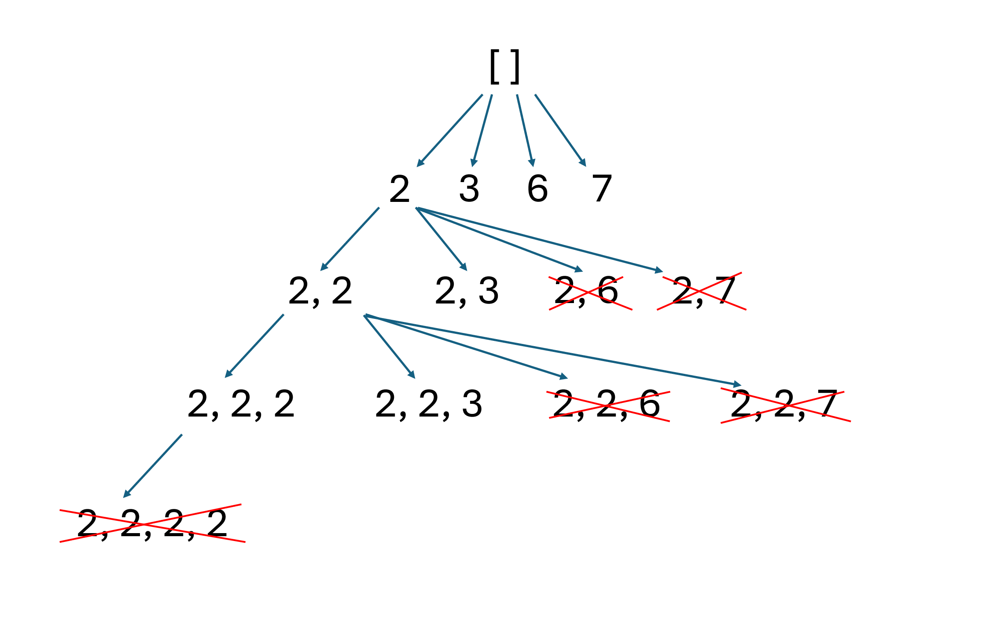

# 39. Combination Sum

> **Difficulty:** Medium  

> **Tags:** Backtracking

> **LeetCode Link:** [39. Combination Sum](https://leetcode.com/problems/combination-sum)

> **Solution:** [`solution.py`](./solution.py)

---

## Intuition

Find every combinations via backtracking. Use a `start` index to skip all duplicated combination.

## Approach
1. **Recursive Tree**
   - 

## Complexity 
|   | Complexity | Explanation |
|--------|-----------|-------------|
| **Time** | O(N ^ (T/M)) | N = number of candidates, T = target value, M = minimum candidate value. In the worst case, the recursion tree explores N branches at each of the T/M levels. |
| **Space** | O(T/M) | The recursion depth is at most (T/M) |