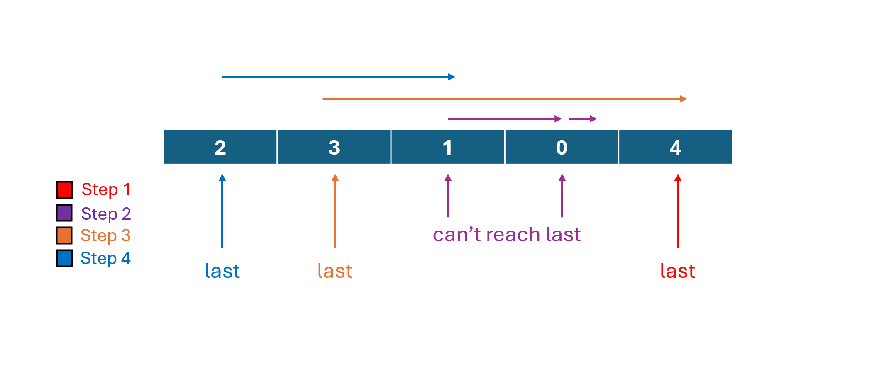

 # 55. Jump Game
> **Difficulty:** Medium  

> **Tags:** Greedy

> **LeetCode Link:** [55. Jump Game](https://leetcode.com/problems/jump-game)

> **Solution:** [`solution.py`](./solution.py)

---

## Intuition

Scan from the end to the beginning. Track the leftmost position that can reach the end. If the current position can jump to or past that tracked position, then the current position can also reach the end. Update the tracked position accordingly. If the tracked position ends up at index 0, the start can reach the end.

## Approach

## Complexity 
|   | Complexity | Explanation |
|--------|-----------|-------------|
| **Time** | O(n) | Each element is visited once. |
| **Space** | O(1) | Only a single variable `last` is used. |