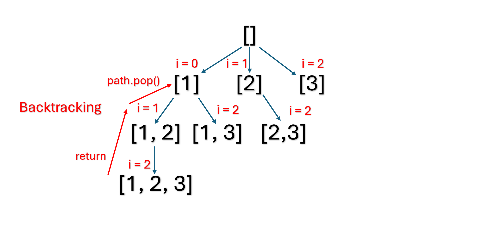

# 78. Subsets

> **Difficulty:** Medium  

> **Tags:** Backtracking

> **LeetCode Link:** [78. Subsets](https://leetcode.com/problems/subsets)

> **Solution:** [`solution.py`](./solution.py)

---

## Intuition

Append the current subset to the result list at every recursive step. Then, starting from the remaining elements of the array, try each element as the next member of the subset. This ensure every combination is generated exactly once without duplicates.

## Approach
1. **Recursive Tree**
   - 

2. **Record the current subset**
   - At the beginning of each recursive step, append a shallow copy (`path[:]`) to `res`. This includes the empty subset `[]` and all combinations.

3. **Recurse with a start index**
   - Iterate from `start` to the end of `nums`.
   - Append `nums[i]` to `path` and recurse with `i + 1` as the new starting point. This guarantees that each element is only considered once per subset path and the index order is always ascending.

4. **Backtrack**
   - After the recursive call returns, pop the last element from `path` to restore the state for the next recursion.

## Complexity 
|   | Complexity | Explanation |
|--------|-----------|-------------|
| **Time** | O(n × 2^n) | There are 2^n total subsets for an array of length n. Recording each subset requires copying a list of length n. |
| **Space** | O(n) | The recursion depth is at most n. The `path` array consume O(n) auxiliary space. This excludes the output space required to store all subsets. |