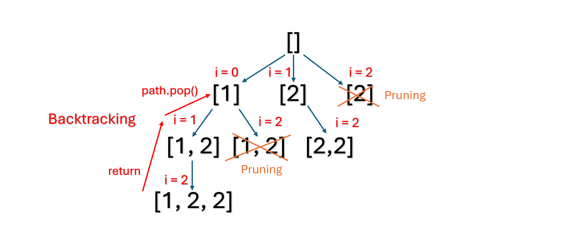

# 90. Subsets II

> **Difficulty:** Medium  

> **Tags:** Backtracking

> **LeetCode Link:** [90. Subsets II](https://leetcode.com/problems/subsets-ii)

> **Solution:** [`solution.py`](./solution.py)

---

## Intuition

Sort the array so duplicates become adjacent. Find the subsets via backtracking. Skip a number if it is the same as its predecessor within the same recursion level.

## Approach
1. **Recursive Tree**
   - 

2. **Sort**
   - Sort `nums` so the numbers of the same value are grouped together, enabling detection of duplicate numbers by comparing with the predecessor.

3. **Pruning rule**
   - If `i > start` and `nums[i] == nums[i-1]`, skip `nums[i]`.  
     This condition detects whether the current value was already considered as the start for this recursion level. Otherwise, using the same value again would produce duplicate subsets already explored through `nums[i-1]`.

## Complexity 
|   | Complexity | Explanation |
|--------|-----------|-------------|
| **Time** | O(n × 2^n) | There are 2^n total subsets for an array up to length n. Recording each subset requires copying a list of length n. The sorting cost O(n log n) is dominated by the subset generation. |
| **Space** | O(n) | The recursion depth is at most n. The `path` array consume O(n) auxiliary space. This excludes the output space required to store all subsets. |