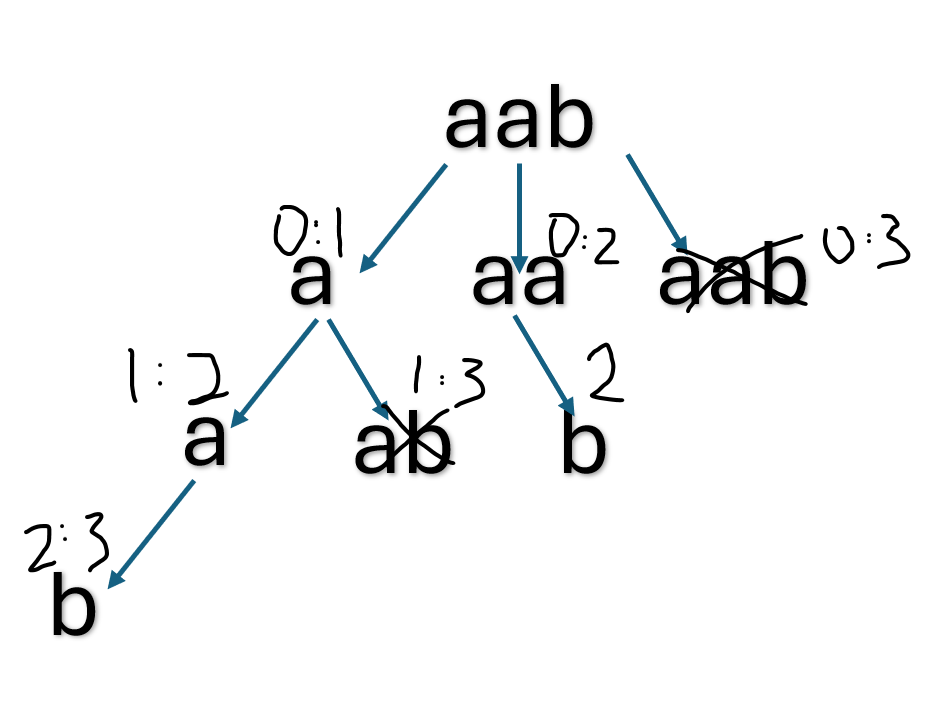

# 131. Palindrome Partitioning

> **Difficulty:** Medium  

> **Tags:** Backtracking

> **LeetCode Link:**

> **Solution:** [`solution.py`](./solution.py)

|   | Complexity | Explanation |
|--------|-----------|-------------|
| **Time** | O(n × 2^n) | A string of length n has at most 2ⁿ⁻¹ possible partition schemes. For each valid partition, copying `path` into the result takes O(n). Palindrome checks add another O(n) factor, but the term is dominated by generating and recording all partitions. |
| **Space** | O(n) | The recursion depth is at most n, and `path` holds at most n substrings at any time. This excludes the output space required to store all partitions. |